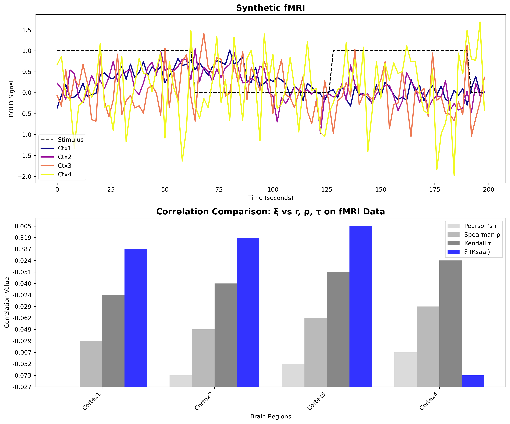

# Coefficients of Correlation Comparison on Non-Monotonic Data
Correlation coefficients r, ρ, τ vs ξ (Ksaai) on non-monotonic data.

[](https://www.python.org/downloads/)
[](https://jupyter.org/)

This project compares **Pearson's r**, **Spearman's ρ**, **Kendall's τ**, and the new coefficient **Sourav Chatterjee's ξ** (Ksaai) on synthetic fMRI signals.

## Dependencies

```bash
pip install numpy pandas scipy matplotlib tabulate
```

## Results

The analysis reveals that ξ (Ksaai) significantly outperforms the other correlation coefficients—Pearson's r, Spearman's ρ, and Kendall's τ—when assessing non-monotonic data (like fMRI signals)



## References

1. A New Coefficient of Correlation (Paper): https://www.tandfonline.com/doi/full/10.1080/01621459.2020.1758115
2. A New Coefficient of Correlation (Article): https://towardsdatascience.com/a-new-coefficient-of-correlation-64ae4f260310
